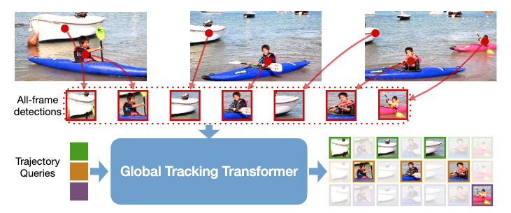
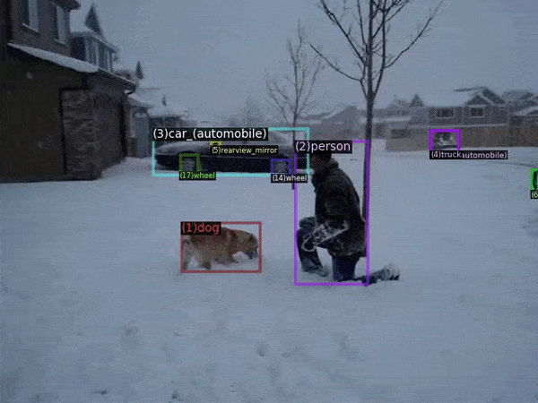

# Global Tracking Transformers

  

> [**Global Tracking Transformers**](http://arxiv.org/abs/2203.13250),               
> Xingyi Zhou, Tianwei Yin, Vladlen Koltun, Philipp Kr&auml;henb&uuml;hl,                 
> *CVPR 2022 ([arXiv 2203.13250](http://arxiv.org/abs/2203.13250))*         

## Features

- Object association within a long temporal window (32 frames).

- Classification after tracking for long-tail recognition.

- "Detector" of global trajectories.

## Installation

See [installation instructions](docs/INSTALL.md).

## Demo

We use the default detectron2 [demo interface](https://github.com/facebookresearch/detectron2/blob/main/GETTING_STARTED.md). For example, to run [TAO model](configs/GTR_TAO_DR2101.yaml) on an example video (video source: TAO/YFCC100M dataset), download the [model](https://drive.google.com/file/d/1TqkLpFZvOMY5HTTaAWz25RxtLHdzQ-CD/view?usp=sharing) and run

~~~
python demo.py --config-file configs/GTR_TAO_DR2101.yaml --video-input docs/yfcc_v_acef1cb6d38c2beab6e69e266e234f.mp4 --output output/demo_yfcc.mp4 --opts MODEL.WEIGHTS models/GTR_TAO_DR2101.pth
~~~

If setup correctly, the output on `output/demo_yfcc.mp4` should look like:

  

## Benchmark evaluation and training

Please first [prepare datasets](datasets/README.md), then check our [MODEL ZOO](docs/MODEL_ZOO.md) to reproduce results in our paper. We highlight key results below:

- MOT17 test set

|  MOTA     |  IDF1  |  HOTA  | DetA  | AssA  | FPS |
|-----------|--------|--------|-------|-------|-----|
| 75.3      |  71.5  | 59.1   | 61.6  | 57.0  | 19.6|

- TAO test set

|  Track mAP  |  FPS   |
|-------------|--------|
| 20.1        |   11.2 |

## License

The majority of GTR is licensed under the [Apache 2.0 license](LICENSE), however portions of the project are available under separate license terms: [trackeval](https://github.com/JonathonLuiten/TrackEval) in `gtr/tracking/trackeval/`, is licensed under the MIT license. [FairMOT](https://github.com/ifzhang/FairMOT) in `gtr/tracking/local_tracker` is under MIT license. Please see [NOTICE](NOTICE) for license details.
The [demo video](docs/yfcc_v_acef1cb6d38c2beab6e69e266e234f) is from [TAO dataset](http://taodataset.org/#), which is originally from [YFCC100M dataset](https://multimediacommons.wordpress.com/yfcc100m-core-dataset/). Please be aware of the original dataset license.

## Citation

If you find this project useful for your research, please use the following BibTeX entry.

    @inproceedings{zhou2022global,
      title={Global Tracking Transformers},
      author={Zhou, Xingyi and Yin, Tianwei and Koltun, Vladlen and Kr{\"a}henb{\"u}hl, Philipp},
      booktitle={CVPR},
      year={2022}
    }
